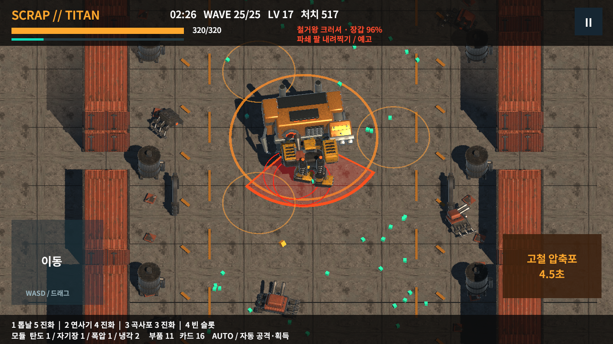
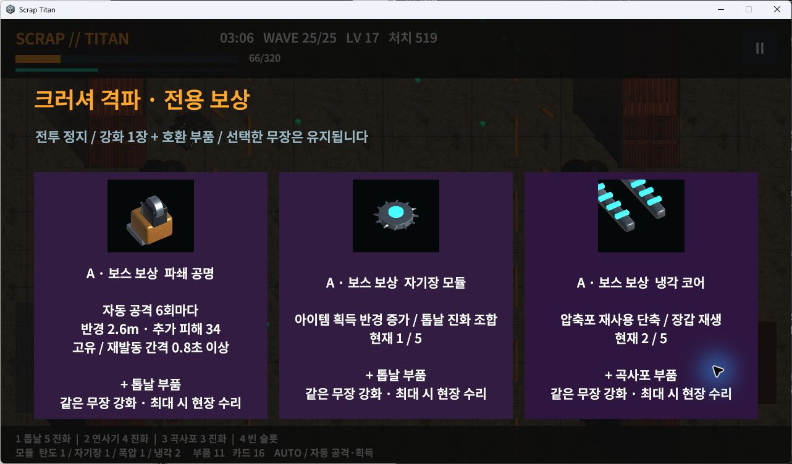

# SCRAP // TITAN

산업용 메카로 폐기 기계 무리를 상대하는 가로 화면 3D 자동 전투 게임입니다. 원래 A 메카를 유지한 Windows 개발 플레이 빌드입니다.

**[Windows v0.5.0 다운로드](https://github.com/NS-DDC/scrap-titan-windows/releases/tag/v0.5.0-windows-v015)**

1. Releases의 `ScrapTitan-v0.5.0-Windows-x64.zip`을 받으세요.
2. ZIP 전체를 압축 해제하세요.
3. `ScrapTitan-Prototype.exe`를 실행하세요. Unity Editor는 필요하지 않습니다.

EXE 옆의 데이터 폴더·DLL을 함께 유지하세요. 비공개 저장소이므로 접근 가능한 계정이 필요합니다. 이전 v014/v012 릴리스도 보존합니다.

## 새로 플레이할 내용

로비의 **크러셔 · 현장 테스트**에서 시작 무장을 고르면 새 적·부품·25보스를 약 3~5분 안에 볼 수 있습니다. 현장 테스트의 결과는 전체 게임 클리어와 구분됩니다.

- 실제 3D 크러셔: 직선 돌진, 정면 파쇄, 체력 절반 이후 빈 통로가 있는 충격파. 경고·공격·정비 상태와 중간 저장.
- 일반 스파크 드레이크: 별도 기계형 모델, 직선 경고와 돌진.
- 부품 운반체: 실제 적재물과 대응하는 카트리지·로터·탄두를 드롭. 같은 종류의 무장 획득·교체·강화에 사용하며 성장 카드는 별도로 유지.
- 세 무장별 실제 진화 장식, 크러셔 보상 3택1과 호환 부품, 자동 공격 6회마다 충격을 내는 파쇄 공명.
- 새 보스 보상·종류별 부품·예고 상태 저장과 중복 지급 방지. v014 저장은 기존 전투 규칙을 유지해 재개.

정규 100웨이브는 25 크러셔를 처치하고 보상을 고른 뒤 26으로 진행합니다. 기존 최종 감독기를 100웨이브에서 처치한 뒤 귀환·결과·로비로 이어집니다. **50 이그니스·75 바스티온·100 오메가와 나머지 확장 무장은 후속 제작 대상입니다.** 기획서 전체를 이번 짧은 테스트로 대체하지 않습니다.

## 조작

| 입력 | 기능 |
|---|---|
| WASD / 방향키 / 왼쪽 패드 드래그 | 이동 |
| Space / 오른쪽 압축포 버튼 | 자동 타기팅 궁극기 |
| 마우스 클릭 | 시작 무장·성장 카드·부품과 슬롯 선택 |
| Escape / 정지 버튼 | 전투 정지 |

공격·조준·근처 획득은 자동입니다. 카드 선택과 일시정지는 전투 시간에서 제외합니다. 자동 무장 4슬롯·지원 모듈 4슬롯·궁극기 1개를 유지합니다. [자세한 플레이 안내](PLAY_GUIDE_KO.md)

## 실제 확인한 범위

Unity에서 세 시작 무장의 현장 테스트는 각각 185.9초·188.0초·186.9초에 끝났습니다. 정규 출격은 100개 웨이브를 실제 Update로 거쳐 1666.2초에 최종 보스를 처치했습니다. 시간 가속·체력 조작 없이 명시적인 자동 이동과 선택을 사용했습니다. 사람의 조작감·난이도 평가나 모바일 FPS 검사가 아닙니다.

새 경고·피해·보상·진화·저장 호환·포화 풀에 대한 64개 경계 검사, 새 프로세스 보상 저장 4개, 세 무장 각각 13개 검사와 정규 전투를 확인했습니다. 16:9·20:9·4:3에서 로비·부품·설정·보스 카드·성장·결과 화면을 렌더하고 검사했습니다.

Windows ZIP을 실제 압축 해제해 Player를 실행했습니다. 자연 진행 중 저장한 크러셔 전투를 이어서 조작한 범위는 [검증 요약](PACKAGE_VERIFICATION.json)에 기록합니다. 이것을 새 Windows 전체 100웨이브 수동 플레이로 표시하지 않습니다.

최종 화면 검사와 Windows/Android 빌드의 Runtime 소스는 일치합니다. 정규 전투 이후에는 글자 잘림을 고친 부품/카드 영역 크기만 바뀌었습니다. 앞선 64+4+39 검사와는 여기에 파쇄 공명 설명에 이미 구현된 최소 재발동 간격 0.8초를 명시한 한 줄이 더 다릅니다. 각 변경을 원본 SHA256과 정확한 치환으로 대조했으며 전투 코드·수치·입력 콜백은 같습니다.

Android ARM64 APK는 빌드했지만 기기 설치·실행·30fps·물리 동시 터치·OS 중단 복구는 아직 확인하지 않았습니다. PC나 화면 비율 검사를 실기기 결과로 대체하지 않습니다.

## 남은 제작

[우선순위와 남은 작업](REMAINING_WORK_KO.md) · [3D 모델·재질·효과 제작 상태](ART_STATUS_KO.md) · [실행 방법](RUN_KO.txt)

이번은 ZIP v3의 첫 증분입니다. 후속 보스·무장·카드·지원·궁극기 변형, 4보스 시간표, 파손·귀환 연출과 다양한 빌드 밸런스가 남아 있습니다. 현재 크러셔 현장 전투 약 42~44초는 제안된 45~75초보다 짧아 후속 조정 대상입니다. 다른 Windows PC 호환성과 사람의 최종 아트·소리·조작감 평가도 남아 있습니다.

ZIP 50,720,874바이트 / SHA256 `cee4bcfd9b5db970115a10ca8fa9594d556f7e98fba894b41ec26cace6091bd0`. 폰트 OFL과 자체 합성 음원 출처를 포함합니다. 개인 저장·개발 DB·원본 첨부 ZIP은 배포하지 않습니다.
