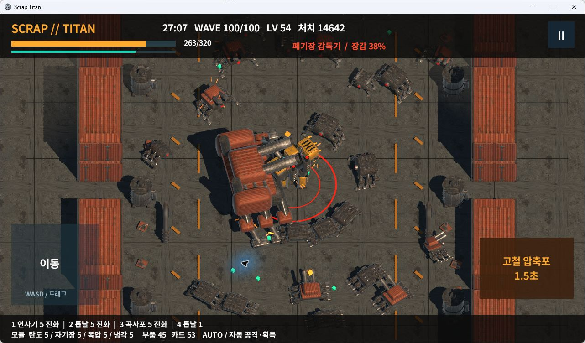

# SCRAP // TITAN — Windows

고철 처리장에서 거대 메카로 적 무리를 처치하고, 카드와 부품으로 무장을 강화·진화시키는 3D 생존 액션 게임입니다.
가로 화면 · 오프라인 싱글플레이 · Windows x64 개발 플레이 빌드.

## 다운로드와 실행

1. [v0.3.1 Windows 다운로드 페이지](https://github.com/NS-DDC/scrap-titan-windows/releases/tag/v0.3.1-windows-v012)의 **ScrapTitan-v0.3.1-Windows-x64.zip**을 받습니다.
2. ZIP 전체를 압축 해제합니다.
3. **ScrapTitan-v0.3.1-Windows-x64/ScrapTitan-Prototype.exe**를 더블클릭합니다.

Unity 설치는 필요하지 않습니다. EXE와 같은 폴더의 데이터/DLL을 함께 유지하세요.
GitHub의 자동 생성 `Source code (zip)`은 실행 게임이 아닙니다. 위 이름의 릴리스 ZIP을 받으세요.
이 저장소는 비공개이며, 저장소 접근 권한이 있는 계정으로 로그인해야 다운로드할 수 있습니다.

| 조작 | 기능 |
|---|---|
| WASD / 방향키 / 왼쪽 패드 드래그 | 이동 |
| Space / 오른쪽 압축포 버튼 | 자동 조준 궁극기 |
| 마우스 클릭 | 시작 무장, 성장 카드, 부품·장착 슬롯 선택 |
| Escape / 일시정지 버튼 | 전투 정지 |

공격·조준·근처 아이템 획득은 자동입니다.
로비에서 짧은 12웨이브(약 3~5분) 또는 정규 100웨이브(전투 약 25~30분)를 선택합니다.
체크포인트가 있으면 이어할 수 있습니다.

## 실제 Windows 화면

실제 정규 전투에서 보관한 보스 체크포인트를 Windows v012에서 이어 실행한 화면입니다.
콘셉트 이미지가 아닙니다.

## 현재 상태

Windows에서 보스전 저장 이어하기·최대 부품 정비·승리를 확인했습니다.
이번 ZIP의 포함 파일과 압축 해제본은 검증된 v012 빌드의 SHA256과 일치합니다.
다른 PC의 실행이나 Android 실기기 성능까지 검증한 것은 아닙니다.
개발 빌드이며 최종 아트·타격감·난이도와 모바일 품질 검증이 남아 있습니다.

- [남은 작업과 검증 범위](REMAINING_WORK_KO.md)
- [실행 안내](RUN_KO.txt)
- 릴리스에 ZIP과 SHA256 체크섬을 함께 제공합니다.

실행 패키지에는 폰트 라이선스 `FONT_OFL.txt`를 포함합니다.
