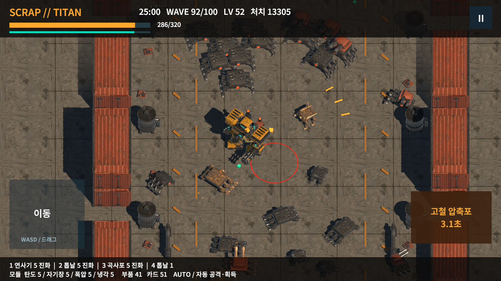
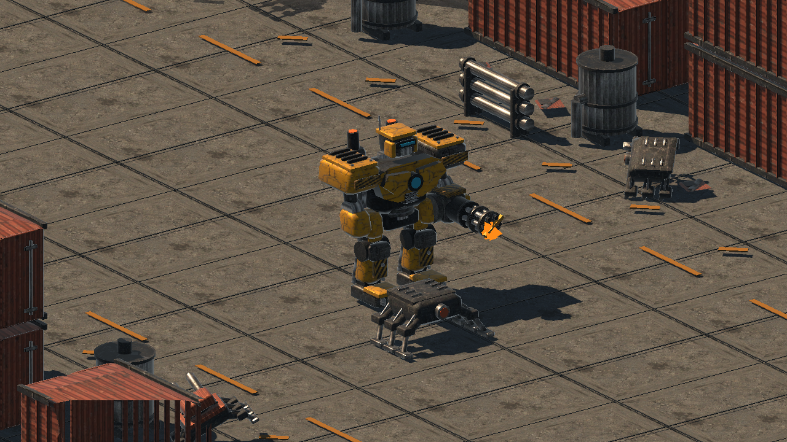
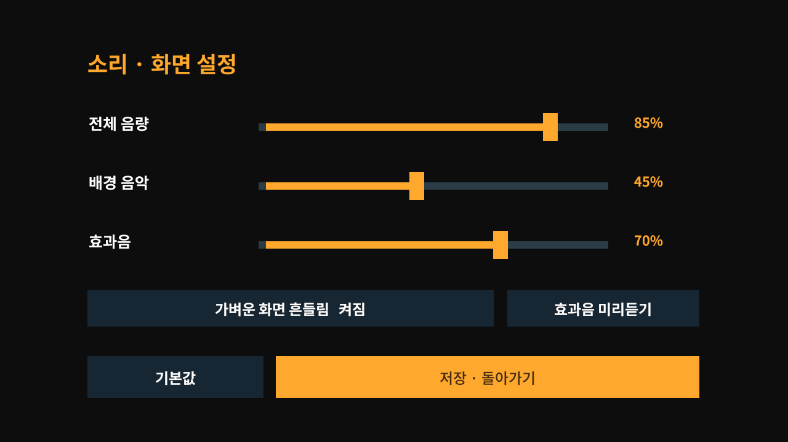

# SCRAP // TITAN

산업용 메카로 폐기 기계 무리를 상대하는 가로 화면 3D 자동 전투 게임입니다. 원래 A 메카를 사용한 Windows 개발 플레이 빌드입니다.

**[Windows v0.4.0 다운로드](https://github.com/NS-DDC/scrap-titan-windows/releases/tag/v0.4.0-windows-v014)**

1. Releases의 `ScrapTitan-v0.4.0-Windows-x64.zip`을 받으세요.
2. ZIP 전체를 압축 해제하세요.
3. 폴더 안의 `ScrapTitan-Prototype.exe`를 실행하세요. Unity Editor 설치는 필요하지 않습니다.

데이터 폴더와 DLL을 EXE 옆에 유지하세요. 비공개 저장소이므로 접근 가능한 GitHub 계정으로 로그인해야 합니다. 이전 v012 릴리스도 보존되어 있습니다.

## 조작과 진행

| 입력 | 기능 |
|---|---|
| WASD / 방향키 / 왼쪽 패드 드래그 | 이동 |
| Space / 오른쪽 압축포 버튼 | 자동 타기팅 궁극기 |
| 마우스 클릭 | 시작 무장·성장 카드·부품과 장착 슬롯 선택 |
| Escape / 정지 버튼 | 전투 일시정지 |

공격·조준·근처 아이템 획득은 자동입니다. 로비에서 12웨이브의 짧은 전투(3~5분) 또는 100웨이브의 정규 출격(25~30분)을 선택합니다. 카드 선택과 일시정지 시간은 전투 시간에서 제외합니다. 최종 보스를 처치하면 귀환 연출과 빌드 결과로 이어집니다. 사망하면 패배 결과에서 재시작할 수 있습니다.

## 이번 변경

- 메카·적·무장·산업 소품 16종에 전용 UV 베이크와 금속·마모·음영·노멀·발광 재질을 적용했습니다.
- 직접 합성한 BGM 3곡과 효과음 16종, 고정 오디오 풀과 전투/선택 상태에 맞춘 소리를 추가했습니다.
- 보행·발소리·무장 반동·피격 표시, 연사기 섬광·톱날 불꽃·곡사포 연기·고철 압축포 광선을 보완했습니다.
- 로비/일시정지에서 전체·음악·효과음 음량, 효과음 미리듣기와 화면 흔들림을 설정할 수 있습니다. 설정은 재실행 후에도 유지됩니다.

## 확인한 결과와 범위

현재 Runtime 소스와 동일한 Unity 전투 검사에서 세 시작 무장이 각각 198.6초·199.7초·206.0초에 승리했습니다. 정규 출격은 100개 웨이브를 거쳐 1632.9초에 최종 보스를 처치했습니다. 명시적인 자동 이동·선택을 사용한 실제 Update 실행이며, 사람의 난이도 평가나 모바일 성능 측정은 아닙니다.

Windows ZIP을 실제로 압축 해제하여 실행했습니다. 마우스로 음량 설정을 바꾸고 별도 프로세스로 재실행해 저장을 확인했습니다. 이전 v012의 자연 진행 보스전 저장을 이어 실행하여 승리·로비를 확인했고, 새 짧은 전투에서 궁극기 클릭·일시정지·자연 패배·재시작을 확인했습니다. 보스전 저장 이어하기를 새 Windows 전체 27분 수동 플레이로 표기하지 않습니다.

카드 정지·부품 교체·진화·궁극기·생성 상한, 손상 저장 복구·새 프로세스 이어하기, 실제 DSP 샘플 출력·재질, 16:9/20:9/4:3 UI를 별도 검사했습니다. Android APK는 빌드했지만 기기 설치·실행·30fps·물리 동시 터치·OS 복구는 아직 확인하지 않았습니다.

## 남은 작업과 출처

[남은 작업 목록](REMAINING_WORK_KO.md) · [실행 방법](RUN_KO.txt) · [플레이와 진화 안내](PLAY_GUIDE_KO.md) · [자산과 소리 제작 상태](ART_AUDIO_STATUS_KO.md)

사람의 최종 아트·청취·조작감·반복 플레이 평가와 다른 Windows PC 호환성 확인이 남아 있습니다. Android 실기기 품질은 사용자가 기기를 연결한 뒤 진행합니다. 측정되지 않은 최소 사양이나 모든 PC의 실행을 보장하는 정식 출시판은 아닙니다.

ZIP: 45,945,662바이트. SHA256: `65b8a79570cde815c5f9f80f975225756e3f81c574977205a92eec1fe4560007`.
폰트 OFL과 자체 합성 음원 제작 출처를 ZIP에 포함했습니다. 개인 체크포인트·프로젝트 DB·계정 정보는 배포하지 않습니다.
